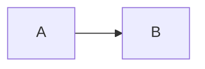
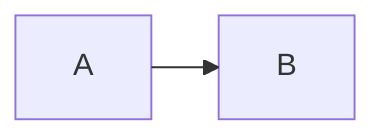

# Markdown 与流式渲染

## 支持的语法

支持标题、列表、引用、表格、任务列表、删除线、链接、图片、代码高亮与脚注。任务列表仅展示，不提供编辑事件。原生 HTML 按文本显示，没有启用 HTML 或 Vue 模板编译的开关。

`[TOC]` 独占一行生成目录；标题与脚注 ID 在组件实例间隔离，应使用 `headings-change` 返回的 id，不要自行推测锚点值。

````markdown
# 示例

[TOC]

- [x] 已完成
- [ ] 待处理

```ts
const message = 'hello';
```


```mermaid
graph LR
  A --> B
```

行内公式：$E=mc^2$

$$
a^2 + b^2 = c^2
$$
````

高亮、KaTeX、Mermaid 按需异步加载。加载或渲染失败会保留源码并触发 `error`；公式需要额外导入 `vmo-markdown-render/math.css`。

## 图片

```markdown

```

图片使用懒加载，默认占满所在内容区宽度，高度按原始比例自适应，不随 `fontBaseSize` 缩放；`unstyled` 移除正文主题，但图片仍保留基础容器布局和默认 100% 宽度，外观可由宿主覆盖。未配置 `baseUrl` 时，URL 由浏览器相对当前页面解析；可通过下文的资源地址配置指定来源与代理。开发工作台提供本地 AI 生成的山峰日出 PNG 图片，可直接检查标题、全宽布局和窄屏展示。

### 图片大图预览

内置图片默认支持点击预览，也可聚焦后按 Enter 或空格打开。预览通过 Teleport 挂载到 `body`，避免被正文容器裁切。链接中的图片仍保留原链接行为。传入 `:image-preview="false"` 可以关闭预览。

```vue
<MarkdownRender
  :content="content"
  :image-preview="{
    enabled: true,
    background: { light: '#ffffff', dark: '#151821' },
    maxScale: 2,
  }"
/>
```

| 配置 | 默认值 | 说明 |
| --- | --- | --- |
| enabled | true | 是否启用预览 |
| background | 当前 Render 背景 | CSS 颜色字符串或 `{ light?, dark? }`；未指定的模式跟随 Render 背景 |
| maxScale | 2 | 相对初始适配尺寸的最大倍率，限制在 1–2；最大宽高各为初始两倍，面积四倍 |
| longPressDownload | 已废弃 | 仅兼容旧配置，已无效果；不会恢复长按菜单 |
| reference | true | 小图悬停时在左下角显示“引用”，边距 5px；通过 image-reference 向宿主提供图片地址，与预览是否启用无关 |

预览继承打开图片的 Render 实例的有效主题、背景和文字颜色，支持 `theme`、祖先 `.dark`、系统主题和 `themeColors`，并在打开期间同步主题变化。背景配置请使用实际 CSS 颜色；Teleport 后无法继承只定义在正文容器中的自定义变量。`unstyled` 仍保留预览交互与必要的全屏布局。

- 鼠标滚轮以光标位置为中心缩放；拖拽平移，图片不会完全移出屏幕；某一方向未超出视口时，该方向保持居中。
- 移动端双指同时缩放和移动，单指拖拽；长按不会触发组件菜单或下载。
- 顶部胶囊左侧只读显示缩放百分比，右侧 X 按钮关闭预览，不支持手动输入；比例随滚轮、双指手势或快捷键缩放同步更新。100% 表示适应屏幕后的尺寸，小图不会在初始显示时强制放大。
- 点击顶部胶囊的 X、图片外空白背景或按 Esc 关闭；点击图片、拖拽和双指手势不会误关闭。支持 `+` / `-` 缩放、`0` 重置。关闭后恢复页面滚动和原焦点。
- 图片区域取消右键 contextmenu 默认行为，并设置 `-webkit-touch-callout: none` 抑制 iOS 图片长按提示。组件不再提供下载／打开原图菜单，也不自动下载；浏览器或宿主 WebView 的原生菜单仍需在目标手机验证。

同一时间只显示一个图片预览。来源图片被移除、更换地址、关闭预览能力或卸载 Render 时，会关闭预览并清理手势和监听。

### 预览配置与接入边界

标准 `` 与高级 `::image` 均走内置图片组件，共享懒加载、资源转换和预览能力；不需要把图片注册到 components。`MarkdownImage` 已从包入口独立导出，可在业务组件和 textRules 的 VNode 中复用并共享 Render 的预览与引用事件。普通 `` 不会自动获得此预览；预览弹层、内部路径与注入 key 不属于公共协议。

`imagePreview` 是 Render 的宿主配置，不是 Markdown 指令属性。`::image{... preview="false"}`、`maxScale`、`style` 等未知属性不会控制弹层；当前没有按图片覆盖、外部受控打开或图库切换 API；点击“引用”会触发 Render 的 image-reference 事件。独立组件与事件参数见 [Render API](../api/markdown-render#独立图片组件与引用事件)。若某张图应直接导航，可使用 `[](/image.png)` 保留图片链接行为；整实例关闭则使用 `false` 或 `{ enabled: false }`。不要在 Markdown 中写 `imagePreview="false"` 代替 Vue 的布尔绑定。

默认及最小尺寸按视窗四周各留 **50px** 计算：原图不超出该区域时保留原尺寸，否则等比缩小至完整可见。此初始尺寸记作 **100%**，不能继续缩小；默认最大 **200%**，即宽高各两倍、面积四倍。50px 只用于初始适配，放大后可以覆盖完整视窗，超出视窗的方向可拖拽查看；未超出的方向仍居中。视窗尺寸变化后重新计算适配尺寸。maxScale 可在 1–2 内进一步限制上限；NaN/Infinity 回退 2，旧的 8 等超范围配置也会限制到 2。正文 width、fontBaseSize 和标题字号上限不控制全屏预览。

`longPressDownload` 仅为兼容旧配置保留，已废弃且无效果，即使传 true 也不会恢复菜单。Tab/Shift+Tab 将焦点保持在胶囊的关闭按钮上，Enter/空格可关闭；没有输入框，不会主动唤起手机键盘。提示和辅助名称使用中文，没有预览 i18n 配置。

预览使用经过 baseUrl/resolveUrl 处理后的**同一个 src**，没有另一个高清图地址字段。打开可能再次进行图片加载/解码，是否复用缓存由浏览器决定；代理或签名 URL 需在使用期间保持有效。

图片加载失败只在弹层内显示提示，不触发 Render 的 `error` 事件；`resolveUrl` 拒绝地址、转换异常等才按已有协议报告 `stage: 'resource'`。预览没有下载请求、文件名处理、下载 CORS 回退或打开原图入口。

Teleport 的弹层位于 body，正文祖先选择器或只匹配 Render 后代的 scoped 样式无法直接覆盖它。优先用 imagePreview.background 和实例 theme/themeColors 配色；该背景字段接收 CSS 颜色，不沿用 ThemeColor 的运行时格式校验。一般无需自行指定 z-index；它使用固定全屏布局并锁定 body 滚动。只改外部 CSS 变量/背景时，会在下次打开或相关主题配置更新时重新取色，不监听任意外部样式变化。

下面可切换主题、预览开关和最大倍率；打开后查看顶部缩放百分比，按 Esc 退出。

<script setup>
import ImagePreviewDemo from '../examples/ImagePreviewDemo.vue';
import MediaProtocol from '../examples/MediaProtocol.vue';
</script>

<ClientOnly><ImagePreviewDemo /></ClientOnly>

<<< ../examples/ImagePreviewDemo.vue

完整选项类型见 [Render API](../api/markdown-render#图片预览配置)，触屏和跨域检查见 [测试与兼容性](./testing#语音与图片预览的人工验收)。

<ClientOnly><MediaProtocol /></ClientOnly>

### 显式媒体指令（推荐）

支持 Generic Directives 的单行 leaf 语法子集；image/audio/video 名称与属性是本库媒体协议 v1，不是 CommonMark 官方媒体标准。无需根据文件后缀猜测类型。

```markdown


::image[高级图片]{src="/images/example.png" width="60%" title="可选标题"}

::audio[录音说明]{src="/media/example.mp3" type="audio/mpeg"}

::video[演示说明]{src="/media/example.mp4" type="video/mp4" poster="/images/cover.png" width="80%"}
```

每个指令独占一行；`src` 必填，`[]` 为纯文本说明（图片 alt／播放器 aria-label），`title` 可选。属性推荐使用双引号；支持单引号和无空格的无引号值，以及 Markdown 转义、实体。此版本不支持行内指令、容器指令、嵌套正文、class/id 快捷语法或任意组件指令。自定义业务组件沿用原有白名单标签设计。

| 属性 | 支持范围 | 规则 |
| --- | --- | --- |
| src | 三类媒体 | 相对路径或 HTTP(S)，经过 baseUrl / resolveUrl |
| title | 三类媒体 | 鼠标提示 |
| width | 图片、视频 | 仅百分比，0% < 值 ≤ 100%；缺省或非法值回退 100% |
| type | 音频、视频 | 可选 MIME，如 audio/mpeg、video/mp4；不匹配类别或格式非法时忽略 |
| poster | 视频 | 封面图片，按 image 资源经过 baseUrl / resolveUrl |

图片和视频高度自动保持原始比例，不支持独立 height；默认全宽且不随字号缩放。音频播放器始终全宽，忽略 width。专用 width 会保留在 unstyled 模式；图片仍保留默认 100% 宽度的基础布局，视频未指定 width 时由宿主决定布局。未知属性与指令原文保留在内部解析节点，不透传到 DOM；事件、style、autoplay 等属性不执行。当前未提供 Markdown 导出器。非法／未闭合指令和未知指令保留为文本，不挂载；流式输入只识别原文中完整的一行，补全器不能制造资源请求。

原生控件默认 controls、preload=metadata、无自动播放；视频 playsinline。资源不可用时仍遵循浏览器加载失败行为，危险 URL 及转换失败会移除地址并报告 resource 错误。MIME 与 src 分开声明，地址可无后缀。

## 音频与视频

旧版 `audio` / `video` 单 URL 围栏继续兼容，推荐新文档使用上述显式指令。

````markdown
```audio
/media/example.mp3
```

```video
/media/example.mp4
```
````

渲染为浏览器原生播放器，默认显示播放控件、只预加载元数据、不自动播放；视频支持行内播放。默认全宽，图片和视频使用 `--md-radius` 圆角；`unstyled` 下由宿主设置样式。音视频原生控件通过 `color-scheme` 跟随实例主题（包括宿主暗色和 auto 模式）；具体外观及暗色支持由浏览器决定。

媒体围栏不支持标题或多行配置；不符合格式时保留为代码块。资源需由宿主提供，能否播放取决于浏览器支持的编码、资源地址及服务器响应。不自动将普通链接或图片语法识别为媒体，不嵌入第三方 iframe，也不需要开启原生 HTML。

## 提示块

```markdown
> [!WARNING] 发布前检查
> 请确认配置已更新。
```

| 标记 | 语义色 |
| --- | --- |
| IMPORTANT | primary |
| NOTE / INFO | info |
| TIP / SUCCESS | success |
| WARNING | warning |
| CAUTION / DANGER / ERROR | danger |

INFO、SUCCESS、DANGER、ERROR 是本库别名；TIP 表示技巧。标题优先级为 Markdown 内自定义标题、`alertLabels` 对应的大写键、默认英文类型名。

```vue
<MarkdownRender
  :content="content"
  :alert-labels="{ IMPORTANT: '重点', NOTE: '备注', TIP: '建议', WARNING: '警告' }"
/>
```

## 流式内容

`content` 始终传入已收到的完整内容，每个网络分片追加到宿主状态；开始时开启 `streaming`，结束或中断后关闭。

```vue
<script setup lang="ts">
import { ref } from 'vue';
import { MarkdownRender } from 'vmo-markdown-render';

const content = ref('');
const streaming = ref(false);
async function consume(chunks: AsyncIterable<string>) {
  content.value = '';
  streaming.value = true;
  try {
    for await (const chunk of chunks) content.value += chunk;
  } finally {
    streaming.value = false;
  }
}
// 将你的网络分片异步迭代器传给 consume(chunks)。
</script>

<template>
  <MarkdownRender :content="content" :streaming="streaming" />
</template>
```

流式模式尝试补全 Markdown 展示，生成结束后重新按原文解析。组件标签必须完整才挂载；正则规则需自行设置结束条件，详见 [组件注入](./components) 与 [正则规则](./text-rules)。

### MDN 在线示例

工作台已嵌入以下在线资源：

- [音频来源](https://developer.mozilla.org/en-US/docs/Web/HTML/Reference/Elements/audio)：`https://developer.mozilla.org/shared-assets/audio/t-rex-roar.mp3`
- [视频来源](https://developer.mozilla.org/en-US/docs/Web/Media/Guides/Formats/Containers)：`https://developer.mozilla.org/shared-assets/videos/flower.mp4`

## 资源地址与代理

`baseUrl` 补全内置图片、音频、视频的相对路径；`resolveUrl` 在补全之后同步转换地址，可用于代理、CDN 或已准备好的签名地址。

```vue
<script setup lang="ts">
import { MarkdownRender, type ResourceUrlResolver } from 'vmo-markdown-render';
const content = '';
const resolveUrl: ResourceUrlResolver = (url, { type, originalUrl }) => {
  console.log(type, originalUrl); // image / audio / video 与 Markdown 原始地址
  return `/api/resource-proxy?url=${encodeURIComponent(url)}`;
};
</script>

<template>
  <MarkdownRender :content="content" base-url="https://example.com/docs/article/" :resolve-url="resolveUrl" />
</template>
```

- `./cover.png` → `https://example.com/docs/article/cover.png`。
- `../audio.mp3` → `https://example.com/docs/audio.mp3`。
- `/video.mp4` → `https://example.com/video.mp4`。
- 完整地址保持其来源域名；`//cdn.example.com/a.png` 使用基址协议。

`baseUrl` 必须是绝对 URL，遵循标准 URL 解析规则；不以 `/` 结尾的路径按文件地址处理。未配置时保留原地址，回调可能收到相对地址，最终由浏览器解析。SSR 不依赖 window 或当前页面地址。

回调是同步纯转换函数，可能随重新渲染多次调用，不应在里面发请求；异步签名应由宿主预先获取后更新 props。没有扩展名的资源也能通过 `type` 准确区分。它仅处理内置资源，不处理链接、代码、正则回调输出的 VNode 或注入组件内部的资源。

处理前后均拒绝危险协议，资源仅接受相对地址或 HTTP(S)。空地址不请求；无效基址、转换回调抛错或返回无效地址时移除 `src`，触发 `error`，其 `stage` 为 `resource`，不会回退请求原资源。

### 资源加载失败

地址转换失败与浏览器加载失败是不同阶段，资源元素不会因为失败就自动移除：

| 情况 | 页面表现 | Render 的 error 事件 |
| --- | --- | --- |
| baseUrl 无效、resolveUrl 抛错或返回无效地址 | 移除 src，保留媒体元素；视频封面转换失败时仅移除 poster | `stage: 'resource'` |
| 地址有效但图片 404、网络或解码失败 | 保留 img，由浏览器显示破图、alt 或空白；没有统一错误占位 | 不自动上报 |
| 音视频资源请求或解码失败 | 保留原生播放器，无法正常播放；错误画面与提示由浏览器决定 | 不自动上报 |
| 大图预览图片加载失败 | 弹层显示“图片加载失败，请稍后重试。” | 不自动上报 |

独立 MarkdownImage 的 `@error` 是透传的原生图片 Event，可由宿主处理，与 Render 的 MarkdownError 不同。独立组件不执行 baseUrl/resolveUrl；需要转换时由宿主提供 src。见 [独立图片 API](../api/markdown-image#加载失败与原生事件)。

URL 转换不会创建代理服务；代理后端由宿主实现，音视频应支持 Range 请求。若代理涉及来源限制与鉴权，由后端统一处理。

给模型使用的简版/详细版协议与多媒体输出规则，见 [模型输出协议与提示词](./model-prompts)。

## Mermaid 布局与渲染

Mermaid 使用屏幕外、保留布局能力的专用容器测量，绘制中的临时 SVG 不会显示在正文外或扩大页面。多图按队列隔离主题；仅切换主题时保留旧图，新图成功后替换。失败仍回退源码并触发 `stage: 'mermaid'` 错误，过期结果不会覆盖最新内容，临时容器在绘制结束的 finally 中清理。

默认使用 Dagre 布局，减少 Mermaid 12 默认 ELK 布局在主线程上的计算开销。与 ELK 相比，节点位置和连线路径会有所不同；需要 ELK 时，可在 Mermaid 围栏内的源码开头指定 `config.layout`。队列中已被新内容替代或已卸载的图表会在开始绘制前跳过；已经开始的布局仍需等待完成。图片预览的打开、关闭不会重新布局已有图表。

````markdown

```mermaid
---
config:
  layout: elk
---
flowchart LR
  A --> B
```
````

Mermaid 在默认 12px 时适配容器宽度，随后按 fontBaseSize 缩放整图。放大时超出视口的部分可拖拽查看，不再用 max-width 强制压回容器；`--md-font-max-size` 仍约束缩放后的文字。

协议补充：指令名和属性名区分大小写，src 必须小写；属性重复时后值覆盖前值。v1 所有属性值都是字符串，必须有等号，不支持布尔简写、JSON 参数或文件扩展名推断。视频 metadata 就绪后以视频本身的比例覆盖不同尺寸封面的比例；更换 src/MIME 会重建播放器以正确重载，调整 width 不重建播放器。
